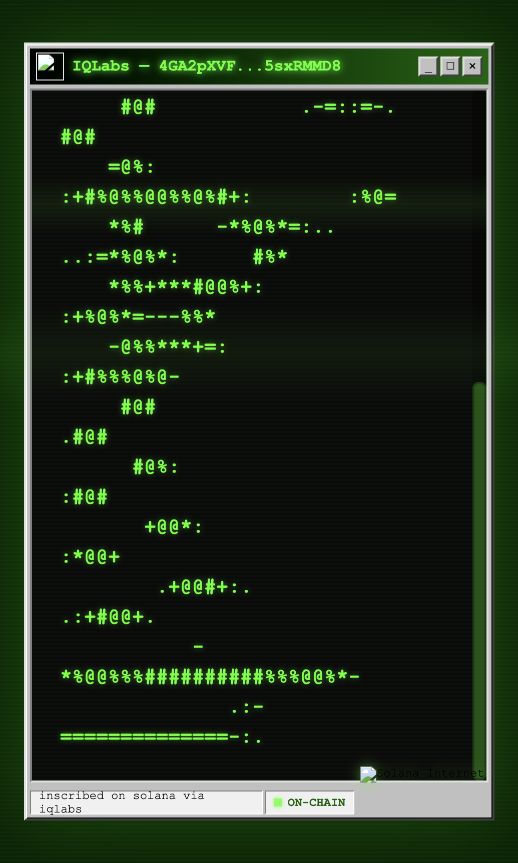
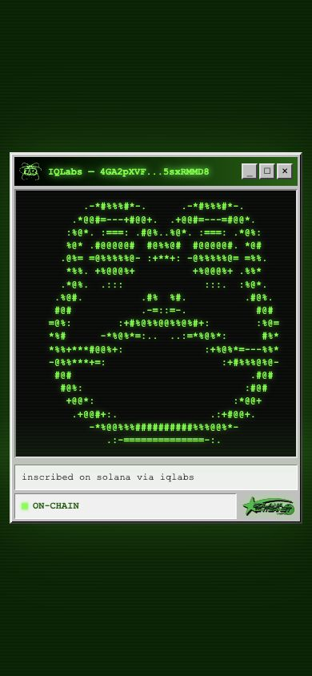
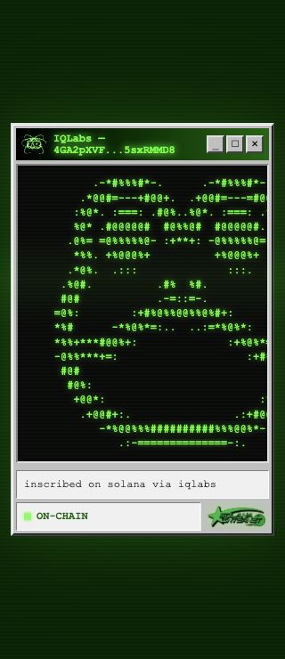
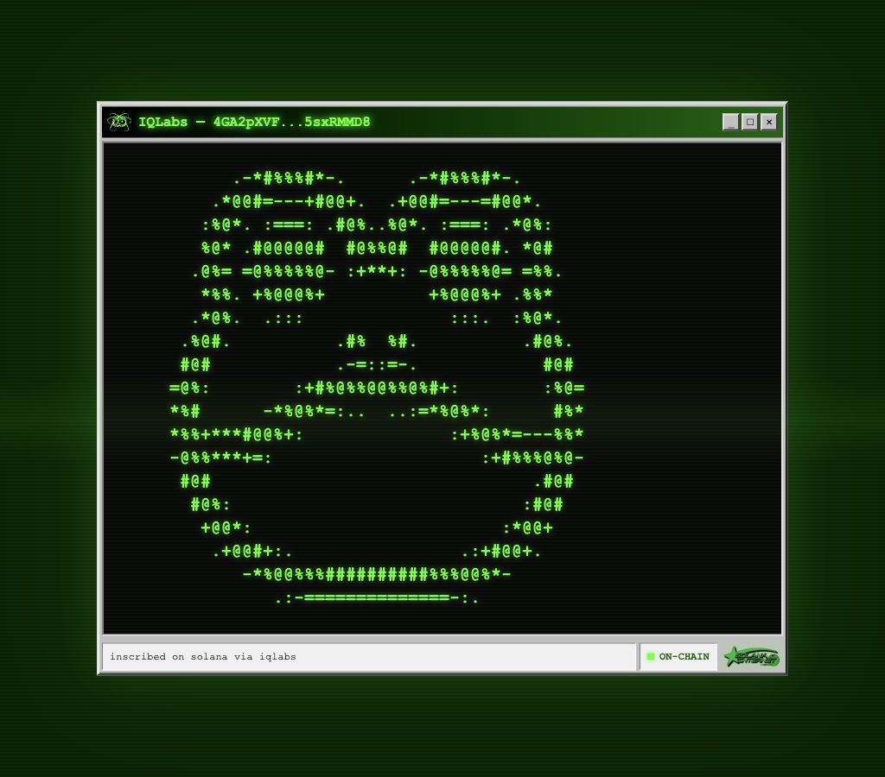
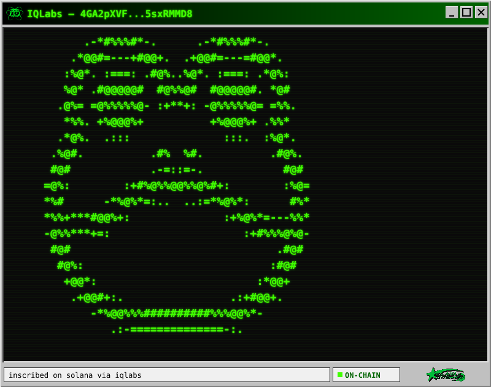

# Inscription branding and responsive layout verification

2026-09-16, based on upstream `4a70e41`.

Production `/iq_logo.svg` and `/solana-internet.png` both returned 404. The
HTML viewer displayed broken images; the PNG renderer referred to those files
through relative paths, but neither file existed in the repository.

The fix bundles the original artwork from `IQCoreTeam/iq-wide-web` commit
`7ccc26d1ad5a53dacdfd2b51956f04c50538c1bf` and embeds it in both outputs.
No new artwork, inscriptions, or transactions were created.

## Browser evidence

Existing public frog inscription:
`4GA2pXVF79sWUXbygXyWhop5Rs5mBc3cq7S1Vv7VJSHroskpsdCjgcsYENdhRHPNyH3w5AESSow2nDFE5sxRMMD8`.

Production before:

Local full gateway after, same inscription read from mainnet:

Both HTML images report `complete=true` and nonzero natural dimensions.
Multiline ASCII art and indented content preserve whitespace in both Solana and
EVM HTML templates. Ordinary prose still wraps. The footer now contains its
text and a 24px-high logo.

Chrome viewport emulation, not physical device testing:

At 390px the frog fits. At 320px the content region scrolls horizontally
without widening the page. DOM measurements confirmed preformatted whitespace,
no page overflow, and contained footer text/logo at 320, 390, and 1024px.
A separate keyboard-scroll interaction timed out in browser control and is not
claimed as verified.

Actual `/render` PNG:

## Validation

- `bun install --frozen-lockfile`
- `bun test`: 117 pass, 0 fail (includes 2 branding regressions and a shared
  Solana/EVM layout regression with Korean text).
- Tests rasterize the SVG with resvg and verify that both logo regions change
  pixels compared with an otherwise identical image with the logos removed.
- `bun run build`: passed.
- `git diff --check`: passed.
- Both original static logo paths return HTTP 200 locally.

## Deployment

The application render cache uses a revision and output-format key, so old
persisted PNGs are not reused. New HTML references a revisioned OG image URL.
Generated HTML/PNG responses revalidate after five minutes; raw on-chain asset
cache policy is unchanged. Previously served unversioned URLs had a one-year
immutable cache header: purge `/view/*` and `/render/*` from the deployment's
CDN when shipping, or use a fresh query string to see the new template.

## Other repositories

Read-only archive scan of all 27 current IQCoreTeam default branches found
these missing references only in iq-gateway. iq-wide-web and iq6900 include
their referenced artwork. AgentNet embeds its logo. iq-chan has a stale gateway
hostname in its README, handled separately. This was a source/reference audit,
not an end-to-end test of every deployed application.
